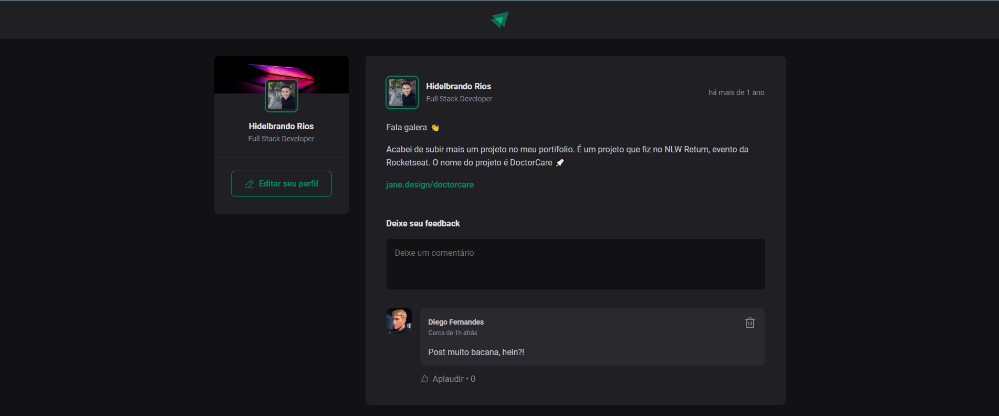

<h1 align="center"> Ignite Feed </h1>

Ignite feed é um projeto simples que simula o feed de uma rede social,
com funcionalidades de comentários, likes e apagar comentário.  

  <a href="#-tecnologias">Tecnologias</a>&nbsp;&nbsp;&nbsp;|&nbsp;&nbsp;&nbsp;
  <a href="#-projeto">Projeto</a>&nbsp;&nbsp;&nbsp;|&nbsp;&nbsp;&nbsp;
  <a href="#-layout">Layout</a>&nbsp;&nbsp;&nbsp;|&nbsp;&nbsp;&nbsp;
  <a href="#memo-licença">Licença</a>

  

 

  

## 🚀 Tecnologias

Esse projeto foi desenvolvido com as seguintes tecnologias:

- Typescript
- Node.js
- ReactJS
- Git e Github
- Figma

## 💻 Projeto

Ignite feed é um projeto simples que simula o feed de uma rede social, que contém as seguintes funcionalidades:

- Adicionar comentários
- Apagar comentários
- Aplaudir (likes)  
<!-- - [Acesse o projeto finalizado, online](https://) -->

## 🌐 Como usar

1. Clonar repositório
``git clone https://github.com/H1d3l/reactjs-ignite-feed.git ``

2. Instalar dependências
``yarn`` ou ``npm i``

3. Subir projeto Local
``yarn dev`` ou ``npm run dev``

4. Acessar projeto
``http://localhost:5173/``

## 🔖 Layout

Você pode visualizar o layout do projeto através [DESSE LINK](https://www.figma.com/community/file/1113573231685349036). É necessário ter conta no [Figma](https://figma.com) para acessá-lo.

---

Feito com ♥ by ``Hidelbrando Rios - @hidelrios``.